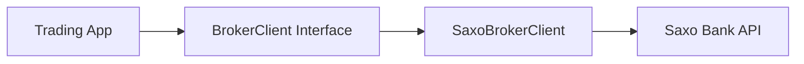

# Saxo Adapter Documentation

This directory contains documentation specific to the **saxo-adapter** repository.

## Documentation Files

### Session Documentation
- **SESSION_1_COMPLETE.md** - Completion report for extraction Session 1
- **SESSION_2_COMPLETE.md** - Completion report for standalone adapter Session 2

### Technical Documentation
- **ARCHITECTURE.md** - Complete architecture guide
  - Layer design (generic vs Saxo-specific)
  - Interface contracts
  - Conversion patterns
  - Multi-broker support strategy
  - WebSocket architecture
  - Error handling
  - Thread safety

### Future Documentation (To Be Added)
- **API.md** - Complete API reference for all interfaces
- **USAGE.md** - Practical usage examples and best practices
- **TESTING.md** - Testing strategy and running tests
- **DEPLOYMENT.md** - Production deployment considerations
- **CONTRIBUTING.md** - Guide for contributors

---

## Documentation Organization

### What Belongs Here (saxo-adapter/docs/)
✅ Saxo adapter-specific documentation:
- Architecture and design patterns
- Interface specifications
- Saxo Bank API integration details
- OAuth2 flow specifics
- WebSocket implementation
- Testing the adapter
- Using the adapter in any Go project

### What Belongs in pivot-web2/docs/
✅ pivot-web2-specific documentation:
- Trading strategy implementation
- How pivot-web2 uses the Saxo adapter
- Migration guide from internal adapter to public adapter
- pivot-web2 architecture and workflows
- Deployment of pivot-web2 trading system

### Shared Concepts
Some concepts span both projects:
- **Generic broker interfaces** - Documented here (saxo-adapter defines them)
- **Trading strategy patterns** - Documented in pivot-web2 (strategies use them)
- **Multi-broker support** - Architecture here, implementation in pivot-web2

---

## Quick Navigation

### For Adapter Users
Start with:
1. **README.md** (root) - Quick start and installation
2. **ARCHITECTURE.md** - Understanding the design
3. **API.md** (future) - Interface reference

### For Adapter Developers
Read:
1. **ARCHITECTURE.md** - Design principles
2. **SESSION_1_COMPLETE.md** & **SESSION_2_COMPLETE.md** - Implementation history
3. **TESTING.md** (future) - Test strategy

### For pivot-web2 Integration
See:
1. **README.md** (root) - Installation and basic usage
2. **ARCHITECTURE.md** - Generic interface pattern
3. pivot-web2/docs/workflows/refactoring-best-practice/AI_IMPLEMENTATION_GUIDE.md - Integration guide

---

## Contributing

Documentation improvements are welcome! When adding new documentation:

1. **Create a new .md file** in this directory
2. **Update this README.md** to reference the new file
3. **Follow Markdown best practices**:
   - Use clear headings
   - Include code examples
   - Add diagrams where helpful (Mermaid or ASCII)
   - Keep language clear and concise

4. **Consider the audience**:
   - Who will read this?
   - What do they need to know?
   - What examples would help?

---

## Documentation Standards

### Code Examples
Always include working code examples:
```go
// Bad: Incomplete example
broker.PlaceOrder(order)

// Good: Complete, runnable example
package main

import (
    "context"
    "log"
    saxo "github.com/bjoelf/saxo-adapter/adapter"
)

func main() {
    ctx := context.Background()
    logger := log.Default()
    
    authClient, broker, err := saxo.CreateBrokerServices(logger)
    if err != nil {
        log.Fatal(err)
    }
    
    order := saxo.OrderRequest{
        Instrument: saxo.Instrument{
            Ticker:     "EURUSD",
            Identifier: 21,
            AssetType:  "FxSpot",
        },
        Side:      "Buy",
        Size:      100,
        OrderType: "Market",
    }
    
    response, err := broker.PlaceOrder(ctx, order)
    if err != nil {
        log.Fatal(err)
    }
    
    log.Printf("Order placed: %s", response.OrderID)
}
```

### Diagrams
Use Mermaid for complex flows:


Or ASCII for simple structures:
```
┌──────────────┐
│ Trading App  │
└──────┬───────┘
       │
       ▼
┌──────────────┐
│ BrokerClient │
└──────┬───────┘
       │
       ▼
┌──────────────┐
│  Saxo API    │
└──────────────┘
```

### API Documentation
Document all public interfaces:
```go
// PlaceOrder submits a new order to the broker.
//
// The method accepts a generic OrderRequest and converts it to
// Saxo-specific format internally. Returns OrderResponse with
// the broker's order ID on success.
//
// Parameters:
//   - ctx: Context for cancellation and timeout
//   - req: Generic order request with instrument, side, size, price
//
// Returns:
//   - *OrderResponse: Contains OrderID and status
//   - error: Authentication, validation, or API errors
//
// Example:
//   order := OrderRequest{
//       Instrument: Instrument{Ticker: "EURUSD", Identifier: 21},
//       Side: "Buy",
//       Size: 100,
//   }
//   response, err := broker.PlaceOrder(ctx, order)
func (sbc *SaxoBrokerClient) PlaceOrder(ctx context.Context, req OrderRequest) (*OrderResponse, error)
```

---

## Version History

### v0.1.0 (Current - Under Development)
- Session 1: Code extraction complete
- Session 2: Standalone adapter with local types
- Status: 7/8 tests passing, build successful

### Future Versions
- v0.2.0: All tests passing, instrument adapter fixed
- v1.0.0: Production-ready first release
- v1.1.0: Additional broker support (if adding IBKR adapter alongside)

---

## Getting Help

### For Adapter Issues
- Check existing documentation first
- Look at test files for examples (`*_test.go`)
- Open GitHub issue with:
  - What you're trying to do
  - What happened
  - Expected behavior
  - Minimal reproducible example

### For pivot-web2 Integration
- See pivot-web2/docs/ for integration guides
- Check pivot-web2 examples
- Contact repository maintainer

---

## Roadmap

Documentation planned for future releases:

**v0.2.0**:
- [ ] API.md - Complete interface reference
- [ ] USAGE.md - Practical examples and patterns
- [ ] TESTING.md - Test strategy and guidelines

**v1.0.0**:
- [ ] DEPLOYMENT.md - Production considerations
- [ ] CONTRIBUTING.md - Contribution guidelines
- [ ] CHANGELOG.md - Version history and changes
- [ ] SECURITY.md - Security policy and reporting

**v1.1.0**:
- [ ] MULTI_BROKER.md - Guide to adding new brokers
- [ ] MIGRATION.md - Migrating from other Saxo clients
- [ ] PERFORMANCE.md - Optimization guidelines

---

This documentation structure ensures saxo-adapter can be used independently by any Go project while maintaining clear integration guidance for pivot-web2.
